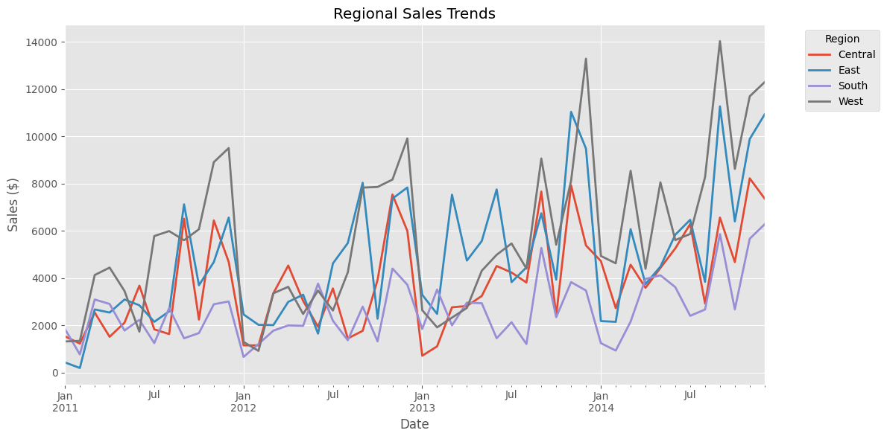
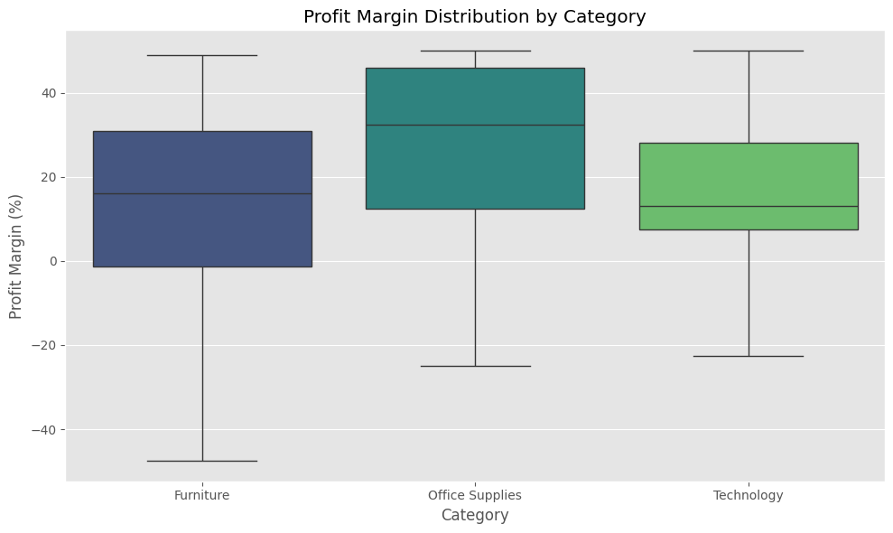

# Superstore Sales Analysis


## Overview
This analysis explores the Superstore sales dataset to uncover key business insights, including sales trends, product performance, regional patterns, and profitability drivers. The goal is to identify opportunities for optimization and growth.

## Setup and Data Loading
A Python script was used to clean the original dataset (both versions are available in this repository) by removing duplicates, handling missing values, correcting inconsistencies, and ensuring proper formatting. The necessary libraries and data are loaded, and key transformations are applied.

```python
# Essential imports
import pandas as pd
import numpy as np
import matplotlib.pyplot as plt
import seaborn as sns

# Configure settings
plt.style.use("ggplot")
pd.set_option("display.float_format", lambda x: "%.2f" % x)

# Load and prepare data
data = pd.read_csv("superstore_sales_clean_data.csv", encoding_errors="ignore")

# Convert dates and select relevant columns
data["order_date"] = pd.to_datetime(data["order_date"], dayfirst=True)
data["ship_date"] = pd.to_datetime(data["ship_date"], dayfirst=True)

essential_columns = [
    "row_id", "order_id", "order_date", "ship_date", "ship_mode", "customer_id", "customer_name", "segment",
    "country", "city", "state", "postal_code", "region", "product_id", "category", "sub-category", 
    "product_name", "sales", "quantity", "discount", "profit"
]
data = data[essential_columns]
```

## Feature Engineering

### Further Data Cleaning
The following transformations ensure there are no missing or zero values in critical columns, and also handle missing discount data to avoid calculation errors.

```python
# Ensure no missing or zero values in quantity and sales to avoid division errors
data["quantity"] = data["quantity"].replace(0, np.nan)
data["sales"] = data["sales"].replace(0, np.nan)

# Extract time-based features
data["year"] = data["order_date"].dt.year
data["year_month"] = data["order_date"].dt.to_period("M")

# Handle missing discount values to avoid NaN issues in calculations
data["discount"] = data["discount"].fillna(0)
data["sales"] = data["sales"].fillna(0)
data["discount_amount"] = data["sales"] * data["discount"]
```

### Feature Creation
Derived key metrics such as gross profit, unit price, fulfillment time, and profit margin for further analysis.

```python
# Feature engineering to derive key business metrics
data = data.assign(
    gross_profit=data["sales"] - data["discount_amount"],
    unit_price=data["sales"] / data["quantity"],
    fulfillment_time=(data["ship_date"] - data["order_date"]).dt.days,  # Shipping duration in days
    profit_per_unit=data["profit"] / data["quantity"],
    profit_margin=(data["profit"] / data["sales"]).replace([np.inf, -np.inf], np.nan) * 100,  # Handle infinite values
    net_sales=data["sales"] - data["discount_amount"]
)
```

## Sales Analysis

### Temporal Trends
Analyzed yearly and monthly sales trends to understand seasonal patterns.

```python
# Function to visualize sales trends
def plot_sales_trends(data):
    fig, (ax1, ax2) = plt.subplots(2, 1, figsize=(12, 8))
    
    # Yearly trends
    yearly_data = data.groupby('year').agg({
        'sales': 'sum',
        'order_date': 'count'
    })
    
    yearly_data['sales'].plot(ax=ax1, color='#003f5c')
    ax1.set_title('Annual Sales')
    ax1.set_ylabel('Total Sales ($)')
    
    # Monthly trends
    monthly_data = data.groupby('year_month')['sales'].sum()
    monthly_data.plot(ax=ax2, color='#003f5c')
    ax2.set_title('Monthly Sales Trend')
    ax2.set_ylabel('Sales ($)')
    
    plt.tight_layout()
    return fig

sales_trends = plot_sales_trends(data)
plt.show()
```
### Sales Trends Analysis:
- The Annual Sales chart reveals consistent yearly growth with notable spikes in Q4 (Nov-Dec), indicating strong seasonal demand.
- The Monthly Sales Trend chart identifies recurring back-to-school peaks in September and a sales dip in the summer months.


### Product Performance
```python
# Function to analyze product performance
def analyze_product_performance(data):
    product_metrics = data.groupby(['category', 'sub-category']).agg({
        'sales': 'sum',
        'profit': 'sum',
        'quantity': 'sum',
        'profit_margin': 'mean'
    }).round(2)
    
    # Visualizing product sales performance
    plt.figure(figsize=(12, 6))
    sns.barplot(
        data=data,
        x='sales',
        y='sub-category',
        hue='category',
        palette='viridis'
    )
    plt.title('Sales by Product Category')
    plt.xlabel('Total Sales ($)')
    plt.ylabel('Sub-Category')
    plt.tight_layout()
    
    return product_metrics

print("\nProduct Performance Metrics:")
print(analyze_product_performance(data))
```
Product Performance Metrics:

| Category         | Sub-category  | Sales    | Profit   | Quantity | Profit Margin |
|------------------|---------------|----------|----------|----------|---------------|
| Furniture        | Bookcases     | 40553.03 | 1244.02  | 813      | 4.23          |
|                  | Chairs        | 92925.47 | 3300.22  | 2223     | 2.83          |
|                  | Furnishings   | 69562.15 | 9897.90  | 3386     | 17.14         |
|                  | Tables        | 44837.05 | 408.03   | 1149     | -3.17         |
| Office Supplies  | Appliances    | 46729.70 | 6082.11  | 1656     | 2.13          |
|                  | Art           | 26005.77 | 5711.74  | 2913     | 25.13         |
|                  | Binders       | 61012.22 | 7182.57  | 5598     | -18.50        |
|                  | Envelopes     | 15871.75 | 3816.88  | 906      | 42.01         |
|                  | Fasteners     | 3024.28  | 949.52   | 839      | 29.92         |
|                  | Labels        | 11070.65 | 3628.78  | 1310     | 42.87         |
|                  | Paper         | 75857.96 | 19841.33 | 4933     | 42.28         |
|                  | Storage       | 94705.96 | 6875.01  | 2999     | 9.38          |
|                  | Supplies      | 9146.73  | 962.27   | 637      | 13.29         |
| Technology       | Accessories   | 93024.68 | 11358.06 | 2769     | 19.39         |
|                  | Copiers       | 5339.81  | 319.99   | 234      | 12.50         |
|                  | Machines      | 12465.32 | 683.50   | 408      | 3.96          |
|                  | Phones        | 117585.54| 11882.03 | 3123     | 10.75         |


### Key Findings:

- **Technology**: Phones lead the sales figures, while copiers underperform.
- **Furniture**: Chairs dominate sales, while bookcases struggle to gain traction.
- **Office Supplies**: Storage and binders show steady growth.

### Regional Analysis
```python
# Function to analyze regional sales trends
def analyze_regional_performance(data):
    regional_sales = data.pivot_table(
        index='year_month',
        columns='region',
        values='sales',
        aggfunc='sum'
    )
    
    fig, ax = plt.subplots(figsize=(12, 6))
    if not regional_sales.empty:
        regional_sales.plot(ax=ax, linewidth=2)
    ax.set_title('Regional Sales Trends')
    ax.set_xlabel('Date')
    ax.set_ylabel('Sales ($)')
    ax.legend(title='Region', bbox_to_anchor=(1.05, 1), loc='upper left')
    plt.grid(True)
    plt.tight_layout()
    
    return regional_sales

analyze_regional_performance(data)
```

| Year-Month | Central  | East     | South    | West     |
|-------------|----------|----------|----------|----------|
| 2011-01     | 1539.91  | 436.17   | 1849.20  | 1322.21  |
| 2011-02     | 1233.17  | 199.78   | 772.77   | 1348.62  |
| 2011-03     | 2543.01  | 2678.16  | 3098.03  | 4133.33  |
| 2011-04     | 1520.07  | 2544.94  | 2908.34  | 4447.85  |
| 2011-05     | 2115.57  | 3097.96  | 1785.37  | 3457.81  |
| 2011-06     | 3684.11  | 2852.37  | 2237.02  | 1736.85  |
| 2011-07     | 1835.36  | 2153.21  | 1253.20  | 5782.50  |
| 2011-08     | 1633.81  | 2596.01  | 2732.49  | 5992.31  |
| 2011-09     | 6512.80  | 7122.09  | 1456.38  | 5605.24  |
| 2011-10     | 2248.63  | 3700.33  | 1676.26  | 6070.87  |
| 2011-11     | 6445.82  | 4683.15  | 2896.78  | 8908.80  |
| 2011-12     | 4685.86  | 6564.54  | 3014.92  | 9505.89  |
| 2012-01     | 1158.11  | 2464.89  | 668.19   | 1302.84  |
| 2012-02     | 1156.85  | 2026.34  | 1215.23  | 924.55   |
| 2012-03     | 3358.45  | 2015.08  | 1779.42  | 3359.54  |
| 2012-04     | 4535.08  | 2997.43  | 2001.26  | 3634.22  |
| 2012-05     | 3037.42  | 3301.95  | 1983.70  | 2484.34  |
| 2012-06     | 1944.88  | 1652.41  | 3767.75  | 3477.22  |
| 2012-07     | 3564.27  | 4623.64  | 2197.27  | 2630.58  |
| 2012-08     | 1449.38  | 5484.93  | 1373.84  | 4244.66  |
| 2012-09     | 1771.54  | 8036.83  | 2794.56  | 7832.25  |
| 2012-10     | 3927.11  | 2283.81  | 1326.52  | 7860.05  |
| 2012-11     | 7537.12  | 7366.66  | 4407.83  | 8171.75  |
| 2012-12     | 6000.30  | 7836.66  | 3722.22  | 9912.36  |
| 2013-01     | 717.36   | 3295.80  | 1851.47  | 2644.33  |
| 2013-02     | 1115.73  | 2488.29  | 3518.66  | 1918.47  |
| 2013-03     | 2766.51  | 7532.76  | 2002.41  | 2330.99  |
| 2013-04     | 2823.22  | 4744.13  | 2965.71  | 2742.19  |
| 2013-05     | 3246.61  | 5572.82  | 2939.67  | 4314.69  |
| 2013-06     | 4514.46  | 7753.72  | 1457.36  | 4988.81  |
| 2013-07     | 4239.01  | 3831.46  | 2134.69  | 5468.23  |
| 2013-08     | 3815.30  | 4457.93  | 1212.64  | 4404.60  |
| 2013-09     | 7667.22  | 6745.19  | 5279.03  | 9063.10  |
| 2013-10     | 2416.20  | 3937.12  | 2349.21  | 5415.48  |
| 2013-11     | 7924.88  | 11037.80 | 3833.62  | 8118.97  |
| 2013-12     | 5383.66  | 9480.92  | 3477.69  | 13285.40 |
| 2014-01     | 4725.14  | 2185.43  | 1251.06  | 4940.01  |
| 2014-02     | 2734.26  | 2152.16  | 937.01   | 4629.36  |
| 2014-03     | 4569.01  | 6073.38  | 2164.34  | 8543.82  |
| 2014-04     | 3592.17  | 3751.03  | 3967.12  | 4399.06  |
| 2014-05     | 4433.10  | 4488.41  | 4122.85  | 8055.52  |
| 2014-06     | 5259.69  | 5838.90  | 3620.67  | 5610.31  |
| 2014-07     | 6291.08  | 6469.84  | 2407.25  | 5870.51  |
| 2014-08     | 2929.98  | 3842.70  | 2674.64  | 8279.76  |
| 2014-09     | 6563.20  | 11270.26 | 5864.65  | 14028.99 |
| 2014-10     | 4681.34  | 6402.58  | 2681.36  | 8623.58  |
| 2014-11     | 8224.14  | 9888.84  | 5667.81  | 11694.93 |
| 2014-12     | 7369.00  | 10926.70 | 6279.91  | 12292.46 |



### Regional Insights:

- West and East regions lead in total sales.
- South region shows opportunity for growth, while the Central region maintains steady performance.

### Profitability Analysis
```python
# Function to analyze profitability
def analyze_profitability(data):
    if 'discount_amount' not in data.columns:
        data["discount_amount"] = data["sales"] * data["discount"]
    
    profit_metrics = data.groupby(['category', 'sub-category']).agg({
        'profit': ['sum', 'mean'],
        'profit_margin': 'mean',
        'discount_amount': 'sum'
    }).round(2)
    
    # Visualizing profit margin distribution
    plt.figure(figsize=(10, 6))
    sns.boxplot(
        data=data,
        x='category',
        y='profit_margin',
        palette='viridis',
        showfliers=False
    )
    plt.title('Profit Margin Distribution by Category')
    plt.xlabel('Category')
    plt.ylabel('Profit Margin (%)')
    plt.tight_layout()
    
    return profit_metrics

print("\nProfitability Metrics:")
print(analyze_profitability(data))
```
Profitability Metrics:

| Category         | Sub-category  | Profit  | Profit Margin | Discount Amount |
|------------------|---------------|---------|---------------|-----------------|
| Furniture        | Bookcases     | 1244.02 | 9.28          | 7126.89         |
|                  | Chairs        | 3300.22 | 8.42          | 16741.82        |
|                  | Furnishings   | 9897.90 | 11.55         | 3727.41         |
|                  | Tables        | 408.03  | 3.68          | 13429.91        |
| Office Supplies  | Appliances    | 6082.11 | 18.49         | 2469.10         |
|                  | Art           | 5711.74 | 7.26          | 1598.23         |
|                  | Binders       | 7182.57 | 5.47          | 5593.51         |
|                  | Envelopes     | 3816.88 | 16.89         | 1053.06         |
|                  | Fasteners     | 949.52  | 4.38          | 240.29          |
|                  | Labels        | 3628.78 | 10.28         | 523.51          |
|                  | Paper         | 19841.33| 15.90         | 5064.27         |
|                  | Storage       | 6875.01 | 9.96          | 6512.03         |
|                  | Supplies      | 962.27  | 5.44          | 558.22          |
| Technology       | Accessories   | 11358.06| 18.47         | 6967.16         |
|                  | Copiers       | 319.99  | 64.00         | 1007.96         |
|                  | Machines      | 683.50  | 20.71         | 1812.35         |
|                  | Phones        | 11882.03| 19.01         | 18423.77        |

### Profit Metrics Table:

- **Profit Margin**: Represents the percentage profit relative to sales.
- **Discount Amount**: Shows the total amount of discounts provided per sub-category.



## Key Insights

1. Sales Patterns
   - Consistent yearly growth with seasonal peaks in Nov-Dec
   - Strong back-to-school sales in September
   - Higher variability in March and Q4

2. Product Performance
   - Technology: Phones lead sales, copiers underperform
   - Furniture: Chairs dominate, bookcases struggle
   - Office Supplies: Storage and binders show steady growth

3. Regional Trends
   - West and East regions lead in sales
   - South shows opportunity for growth
   - Central region maintains steady performance

4. Profitability
   - Overall profit margin >10%
   - High-margin categories: Copiers, Labels, Furnishings
   - Discount impact significant on Tables and Bookcases

## Recommendations

1. Inventory Management
   - Optimize stock levels for seasonal peaks
   - Implement demand forecasting for high-variability periods

2. Regional Strategy
   - Develop targeted growth plans for South region
   - Leverage successful practices from West/East

3. Product Portfolio
   - Review underperforming sub-categories
   - Optimize discount strategy for high-margin products

4. Operational Efficiency
   - Focus on reducing fulfillment times
   - Analyze and optimize shipping costs
