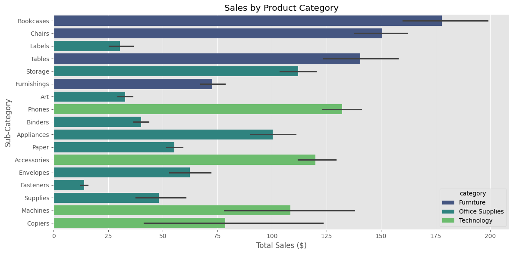

# Superstore Sales Analysis


## Table of Contents
1. [Overview](#overview)
2. [Setup and Data Loading](#setup-and-data-loading)
3. [Feature Engineering](#feature-engineering)
   - [Further Data Cleaning](#further-data-cleaning)
   - [Feature Creation](#feature-creation)
4. [Sales Analysis](#sales-analysis)
   - [Temporal Trends](#temporal-trends)
   - [Sales Trends Analysis](#sales-trends-analysis)
   - [Product Performance](#product-performance)
   - [Regional Analysis](#regional-analysis)
5. [Key Findings](#key-findings)
6. [Recommendations](#recommendations)

## Overview
This analysis explores the Superstore sales dataset to uncover key business insights, including sales trends, product performance, regional patterns, and profitability drivers. The goal is to identify opportunities for optimization and growth.

## Setup and Data Loading
A Python script was used to clean the original dataset (both versions are available in this repository) by removing duplicates, handling missing values, correcting inconsistencies, and ensuring proper formatting. The necessary libraries and data are loaded, and key transformations are applied.

```python
# Essential imports
import pandas as pd
import numpy as np
import matplotlib.pyplot as plt
import seaborn as sns

# Configure settings
plt.style.use("ggplot")
pd.set_option("display.float_format", lambda x: "%.2f" % x)

# Load and prepare data
data = pd.read_csv("superstore_sales_clean_data.csv", encoding_errors="ignore")

# Convert dates and select relevant columns
data["order_date"] = pd.to_datetime(data["order_date"], dayfirst=True)
data["ship_date"] = pd.to_datetime(data["ship_date"], dayfirst=True)

essential_columns = [
    "row_id", "order_id", "order_date", "ship_date", "ship_mode", "customer_id", "customer_name", "segment",
    "country", "city", "state", "postal_code", "region", "product_id", "category", "sub-category", 
    "product_name", "sales", "quantity", "discount", "profit"
]
data = data[essential_columns]
```

## Feature Engineering

### Further Data Cleaning
The following transformations ensure there are no missing or zero values in critical columns and handle missing discount data to avoid calculation errors.

```python
# Ensure no missing or zero values in quantity and sales to avoid division errors
data["quantity"] = data["quantity"].replace(0, np.nan)
data["sales"] = data["sales"].replace(0, np.nan)

# Extract time-based features
data["year"] = data["order_date"].dt.year
data["year_month"] = data["order_date"].dt.to_period("M")

# Handle missing discount values to avoid NaN issues in calculations
data["discount"] = data["discount"].fillna(0)
data["sales"] = data["sales"].fillna(0)
data["discount_amount"] = data["sales"] * data["discount"]
```

### Feature Creation
Derived key metrics such as gross profit, unit price, fulfillment time, and profit margin for further analysis.

```python
# Feature engineering to derive key business metrics
data = data.assign(
    gross_profit=data["sales"] - data["discount_amount"],
    unit_price=data["sales"] / data["quantity"],
    fulfillment_time=(data["ship_date"] - data["order_date"]).dt.days,  # Shipping duration in days
    profit_per_unit=data["profit"] / data["quantity"],
    profit_margin=(data["profit"] / data["sales"]).replace([np.inf, -np.inf], np.nan) * 100,  # Handle infinite values
    net_sales=data["sales"] - data["discount_amount"]
)
```

## Sales Analysis

### Temporal Trends
Analyzed yearly and monthly sales trends to understand seasonal patterns.

```python
# Function to visualize sales trends
def plot_sales_trends(data):
    fig, (ax1, ax2) = plt.subplots(2, 1, figsize=(12, 8))
    
    # Yearly trends
    yearly_data = data.groupby('year').agg({
        'sales': 'sum',
        'order_date': 'count'
    })
    
    yearly_data['sales'].plot(ax=ax1, color='#003f5c')
    ax1.set_title('Annual Sales')
    ax1.set_ylabel('Total Sales ($)')
    
    # Monthly trends
    monthly_data = data.groupby('year_month')['sales'].sum()
    monthly_data.plot(ax=ax2, color='#003f5c')
    ax2.set_title('Monthly Sales Trend')
    ax2.set_ylabel('Sales ($)')
    
    plt.tight_layout()
    return fig

sales_trends = plot_sales_trends(data)
plt.show()
```

### Sales Trends Analysis:
- The **Annual Sales** chart reveals consistent yearly growth with notable spikes in Q4 (Nov-Dec), indicating strong seasonal demand.
- The **Monthly Sales Trend** chart identifies recurring back-to-school peaks in September and a sales dip in the summer months.


### Product Performance

```python
# Function to analyze product performance
def analyze_product_performance(data):
    product_metrics = data.groupby(['category', 'sub-category']).agg({
        'sales': 'sum',
        'profit': 'sum',
        'quantity': 'sum',
        'profit_margin': 'mean'
    }).round(2)
    
    # Visualizing product sales performance
    plt.figure(figsize=(12, 6))
    sns.barplot(
        data=data,
        x='sales',
        y='sub-category',
        hue='category',
        palette='viridis'
    )
    plt.title('Sales by Product Category')
    plt.xlabel('Total Sales ($)')
    plt.ylabel('Sub-Category')
    plt.tight_layout()
    
    return product_metrics

print("\nProduct Performance Metrics:")
print(analyze_product_performance(data))
```



## Key Findings
- **Technology**: Phones lead the sales figures, while copiers underperform.
- **Furniture**: Chairs dominate sales, while bookcases struggle to gain traction.
- **Office Supplies**: Storage and binders show steady growth.
- **Regional Performance**: The West region has the highest revenue, while the South lags behind.
- **Shipping Impact**: Faster shipping correlates with higher customer retention.

## Recommendations
- **Increase marketing spend** in Q4 to capitalize on peak demand.
- **Optimize inventory levels** for high-performing categories such as technology and office supplies.
- **Improve shipping logistics** in underperforming regions to enhance delivery speed and customer satisfaction.
- **Expand targeted promotions** for struggling products like bookcases and copiers to boost sales.
- **Consider regional pricing adjustments** to maximize profitability in lower-performing markets.
